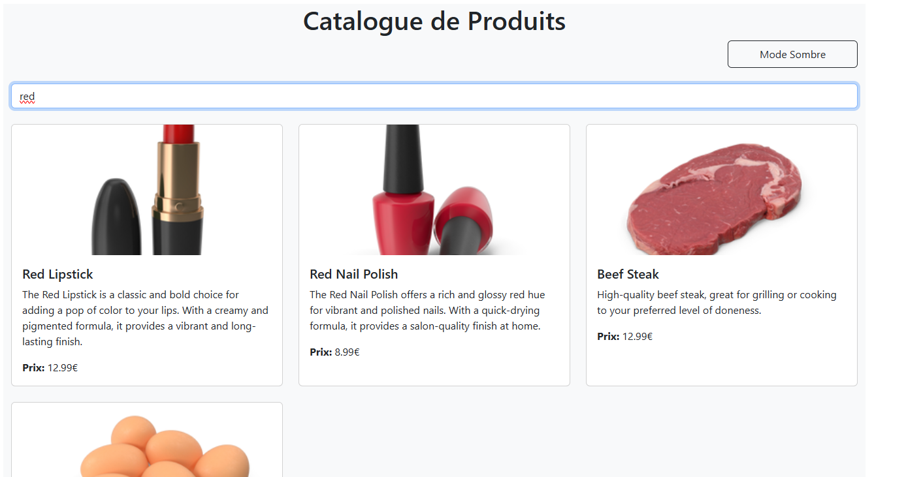
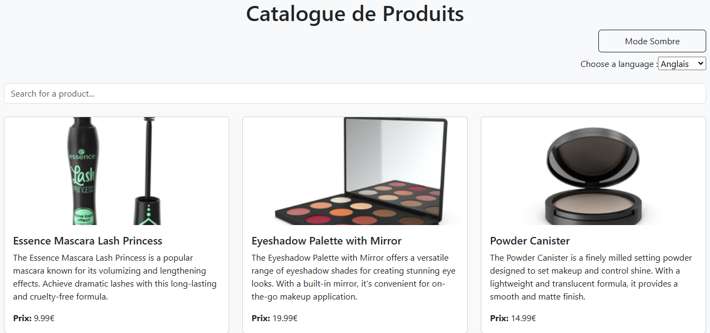
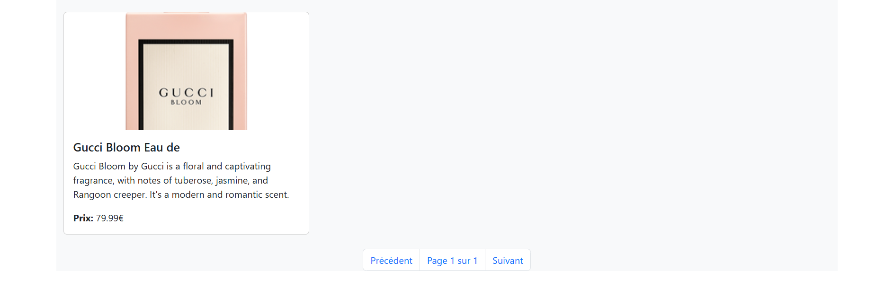

# TP React Hooks - Application de Gestion de Produits

Ce TP a pour objectif de mettre en pratique l'utilisation des Hooks React (useState, useEffect, useContext) ainsi que la création de Hooks personnalisés.

### Exercice 1 : État et Effets 
#### Objectif : Implémenter une recherche en temps réel

- [ ] 1.1 Modifier le composant ProductSearch pour utiliser la recherche
- [ ] 1.2 Implémenter le debounce sur la recherche
- [ ] 1.3 Documenter votre solution ici

_Votre réponse pour l'exercice 1 :_
```

Expliquez votre solution ici
Saisie utilisateur : L'utilisateur tape un terme de recherche dans un champ de texte.

Debounce : Lorsque l'utilisateur tape, un délai de 1 seconde est introduit avant d'envoyer la recherche. Cela permet de ne pas envoyer une requête à chaque frappe, mais d'attendre que l'utilisateur ait fini de saisir (grâce au debounce).

Requête côté client : Dès que l'utilisateur a arrêté de taper pendant 1 seconde, une requête API est envoyée pour chercher les produits correspondants à ce terme. Une fois que les produits sont récupérés, ils sont affichés.

```


### Exercice 2 : Context et Internationalisation
#### Objectif : Gérer les préférences de langue

- [ ] 2.1 Créer le LanguageContext
- [ ] 2.2 Ajouter le sélecteur de langue
- [ ] 2.3 Documenter votre solution ici

_Votre réponse pour l'exercice 2 :_

```
LanguageContext : Nous avons créé un contexte pour gérer l'état de la langue et les traductions dans l'application.

LanguageProvider : Ce composant fournit l'état de la langue et les traductions à toute l'application via le LanguageContext.

useLanguage : Ce hook permet aux composants enfants d'accéder au contexte pour récupérer la langue et les traductions.

translations : Un objet contenant les traductions pour différentes langues est utilisé dans toute l'application pour afficher des textes dans la langue choisie.

Cette approche permet de centraliser la gestion des langues et des traductions dans l'application, tout en permettant une évolution facile (ajouter de nouvelles langues, de nouveaux textes traduits). Grâce à React Context et aux hooks, la gestion de la langue devient simple et efficace pour l'utilisateur final.

```



### Exercice 3 : Hooks Personnalisés
#### Objectif : Créer des hooks réutilisables

- [ ] 3.1 Créer le hook useDebounce
- [ ] 3.2 Créer le hook useLocalStorage
- [ ] 3.3 Documenter votre solution ici

_Votre réponse pour l'exercice 3 :_
```
Le hook useDebounce permet de retarder l'exécution d'une action lorsqu'une valeur change, ce qui est utile pour optimiser les performances (ex: éviter les appels API à chaque frappe dans un champ de recherche).

Le hook useLocalStorage permet de stocker et récupérer des données dans localStorage, tout en mettant à jour automatiquement l'état React.
```

### Exercice 4 : Gestion Asynchrone et Pagination
#### Objectif : Gérer le chargement et la pagination

- [ ] 4.1 Ajouter le bouton de rechargement
- [ ] 4.2 Implémenter la pagination
- [ ] 4.3 Documenter votre solution ici

_Votre réponse pour l'exercice 4 :_
```
On utilise un hook useEffect pour appeler l’API https://api.daaif.net/products.

On ajoute les paramètres skip (combien d’éléments ignorer) et limit (combien en récupérer).

```
